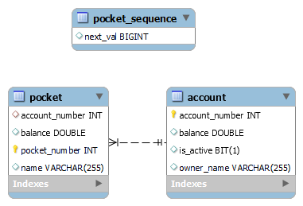
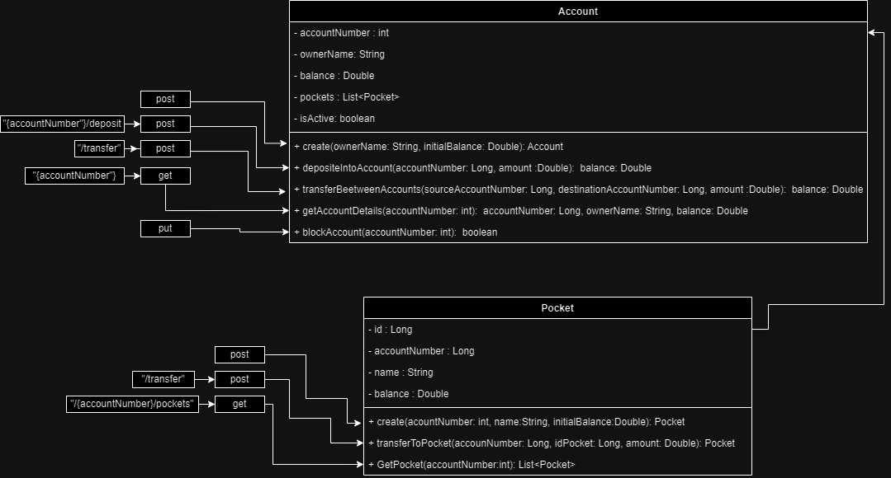

# JeliBank
# Diagramas

# Technologies Used
Language: Java
The project is developed using the Java programming language, known for its portability and robustness in enterprise application development.

* Framework: Spring Boot
Spring Boot is employed as the primary development framework, providing an easy-to-use architecture for building Java applications based on the "convention over configuration" principle.

* RESTful API with Spring MVC
The application follows the REST (Representational State Transfer) architectural style, implementing RESTful web services using the Spring MVC module of Spring Boot.

* Maven
Maven is used as the project management and build tool, simplifying configuration and dependency management.

* H2 Database and MySQL
H2 Database serves as the runtime database for development and testing, while MySQL is integrated as the production database. This configuration allows for an easy transition between databases.

* Lombok
Lombok is employed to reduce the verbosity of Java code by automatically generating methods such as getters, setters, and constructors, improving code readability and maintainability.

* Spring Boot Starter Data JPA and Spring Boot Starter Web
These are Spring Boot starters that facilitate the development of applications with Java Persistence API (JPA) for the persistence layer and Spring Web for creating web services.

* Spring Boot Starter Test
Spring Boot Starter Test provides tools and annotations for writing effective unit and integration tests.

* Log4j
Log4j is used for log management in the application, enabling efficient tracking of events and errors.

This set of technologies offers a solid and efficient environment for the development of banking transactions with Spring Boot, ensuring project quality, maintainability, and scalability.

# cómo se usa la app
# links
# información del problema
# cómo se solucionó
# como se testea 
# cómo se optiene el token de seguridad
