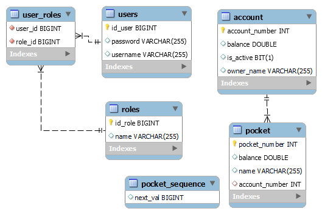
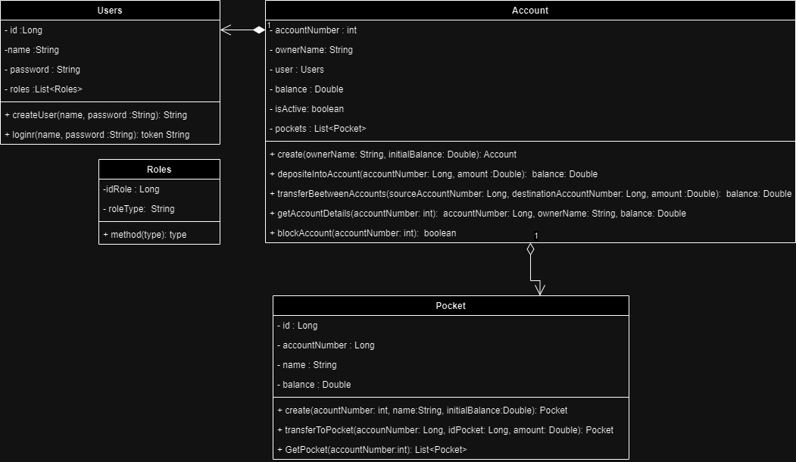

# JeliBank

## Project Overview
  The application facilitates seamless financial management, allowing users to create pockets, perform deposits and transfers, and access comprehensive account and pocket   details. The robust functionality ensures a secure and efficient banking experience.


## Problem Statement
  In the realm of financial management, users often encounter challenges when attempting to seamlessly manage their accounts and associated pockets. Traditional banking systems may lack the flexibility and user-friendly interfaces necessary for efficient transactions. Key issues include:

* Cumbersome processes for creating and managing pockets.
* Limited options for transferring funds between accounts and pockets.
* Lack of a comprehensive overview of account and pocket details.
* Inefficient deposit procedures.

## Solution Overview
  To address these challenges, the JeliBank was developed. This application serves as a dynamic and user-centric solution to streamline financial transactions and enhance overall banking experiences. 

### Key features include:

* Pocket Creation: Intuitive functionality allows users to effortlessly create pockets associated with their accounts, enabling better fund management.
* Efficient Transfers: The application facilitates swift and secure fund transfers between accounts and pockets, ensuring flexibility in financial operations.
* Comprehensive Information Retrieval: Users can easily access detailed information about their accounts and associated pockets, promoting transparency and informed decision-making.
*User-Friendly Deposit Process: Depositing funds into accounts or pockets has been simplified, contributing to a more user-friendly banking experience.

## How the Program Solves the Problem
  The JeliBank addresses these challenges through an optimized combination of technology and financial expertise. By leveraging the Spring Boot framework, Java, and a well-designed database model, the application provides users with a reliable and efficient platform for managing their financial transactions.

  The use of RESTful APIs ensures seamless communication between different components of the system, allowing for swift and secure data exchange. Additionally has standardized HTTP requests enhances accessibility and usability.

  Through JeliBank, users can experience a modern and efficient solution to their financial management needs, overcoming the limitations of traditional banking systems.

## Diagrams



## Technologies Used

### * Language: Java
  The project is developed using the Java programming language, version 17, known for its portability and robustness in enterprise application development.
### * Framework: Spring Boot
  Spring Boot is employed as the primary development framework, providing an easy-to-use architecture for building Java applications based on the "convention over configuration" principle.
### * RESTful API with Spring MVC
  The application follows the REST (Representational State Transfer) architectural style, implementing RESTful web services using the Spring MVC module of Spring Boot.
### * Maven
  Maven is used as the project management and build tool, simplifying configuration and dependency management.
### * H2 Database and MySQL
  H2 Database serves as the runtime database for development and testing, while MySQL is integrated as the production database. This configuration allows for an easy transition between databases.
### * Lombok
  Lombok is employed to reduce the verbosity of Java code by automatically generating methods such as getters, setters, and constructors, improving code readability and maintainability.
### * Spring Boot Starter Data JPA and Spring Boot Starter Web
  These are Spring Boot starters that facilitate the development of applications with Java Persistence API (JPA) for the persistence layer and Spring Web for creating web services.
### * Spring Boot Starter Test
  Spring Boot Starter Test provides tools and annotations for writing effective unit and integration tests.
### * JUnit Jupiter API
  JUnit Jupiter API is utilized for writing and executing unit tests in the JeliBank project.
### * Spring Boot Test
  This dependency from Spring Boot simplifies testing in your project by providing utilities and annotations for writing effective unit and integration tests.
### * Mockito JUnit Jupiter
  Mockito JUnit Jupiter enables the use of Mockito with JUnit Jupiter for effective unit testing in the JeliBank application.
### * Spring Boot Starter Security
  This dependency from Spring Boot provides essential security features to your application, enabling secure authentication and authorization.
### * jwt (JSON Web Token)
  This dependency provides functionality for working with JSON Web Tokens (JWT) in the JeliBank application.

  
This set of technologies offers a solid and efficient environment for the development of banking transactions with Spring Boot, ensuring project quality, maintainability, and scalability.

## How to use the program
### Before
  Make sure you have the following tools and dependencies installed before running the application:
  - [Java JDK](https://www.oracle.com/java/technologies/javase-downloads.html)
  - [Maven](https://maven.apache.org/download.cgi)
  - [MySQL](https://dev.mysql.com/downloads/)

## Project Configuration

  1. Clone the repository to your local machine:
      ``` git clone https://github.com/lizzmedina/JeliBank.git ```
      
  2. Navega al directorio del proyecto:
     
          ``` bash
          cd tuproyecto
          ```
  3. Configure the database in the application.yml file with your MySQL credentials

## Compilation and Execution
  1. Compile the project using Maven:  
          ```bash
          mvn clean install
          ```
  2. Run the Spring Boot application:
  
          ```bash
          mvn spring-boot:run
          ```
The application will be available at [http://localhost:8080](http://localhost:8080).

## Application Usage
### Test
 you can test the functionality throw postman or swagger. Swagger it's implemented on the application, to try, once it's running use this link ``` http://localhost:8080/swagger-ui/index.html# ```
### Interacting with the Application
  To interact with the application, users can perform various financial transactions, including transfers between accounts and deposits into both accounts and pockets. The application provides the following key functionalities:

#### Account Operations 

##### Create an Account:
  Post
  Endpoint: 
         ``` /api/accounts
          ```
  Description: Creates a new pocket associated with the account.  
  BodyRequest: 
  
      ``` 
              {    
                "ownerName":"lina",
                "initialAmount": 100.0
              }
      ```
##### Deposit into an Account:
  Post
  Endpoint:   
        ```  
          /api/accounts/{accountNumber}/deposit
        ```
  Description: Deposits funds into the specified account.
  BodyRequest: 
  
     ```      {
                "amountToDeposite": 200000.0
              }
     ```

##### Transfer Money between Accounts:
  Post
  Endpoint: 
      ```
        /api/accounts/transfer
      ```  
  Description: Transfers funds from one account to another.
  BodyRequest:  
     
      ```     {
                "sourceAccountNumber":1482758457 ,
                "destinationAccountNumber": 1289678331,
                "amountToTransfer":100.0
              }
      ```           
##### Retrieve Account Information:
  Get
  Endpoint: 
      ``` 
          /api/accounts/{accountNumber}
      ```
  Description: Retrieves detailed information about a specific account.
  
##### Lock/Unlock an Account:
  Put
  Endpoint:
    ```       /api/accounts/lock/{accountNumber}
    ``` 
  Description: Locks or unlocks the specified account for added security.
  BodyRequest:  
  
      ```     {
                "accountNumber" : 1289678331
              }
      ```
                
#### Pocket Operations:

##### Create a Pocket:
  Post
  Endpoint:
    ```  /api/pockets
    ``` 
  Description: Creates a new pocket associated with the account.
  BodyRequest:
  
      ```     {
                "accountNumber": 1354238369,
                "name": "viajes",
                "balance": 20.0
              }
      ```

  
##### Deposit into a Pocket from Associated Account:
  Post
  Endpoint:
    ``` /api/pockets/deposit
    ```

  Description: Deposits funds into a pocket from the associated account.
  BodyRequest:
  
      ```     {
                "accountNumber": 1503171576,
                "pocketNumber": 1 ,
                "amount": 5.0 
              }
      ```
              

##### Retrieve Associated Pockets:
  Get
  Endpoint: 
    ```  /api/pockets/{accountNumber}
    ```
  
  Description: Retrieves a list of pockets associated with the specified account.
\
Users can interact with these functionalities either through a user-friendly interface or by utilizing the provided API endpoints. For API interactions, examples of HTTP requests can be provided using tools like cURL or Postman.

## Contributing
  If you want to contribute to this project, follow the steps below:

  * Fork the project.
  * Create a branch for your changes.
  * Make your modifications and test them.
  * Submit a pull request.
  * Known Issues
  * List any known problems or bugs, and if possible, provide solutions or workarounds.

## How to Obtain the Security Token
  When registering a user in the application and subsequently logging in, the system generates a security token. This token allows access to other functionalities such as creating accounts and wallets.

